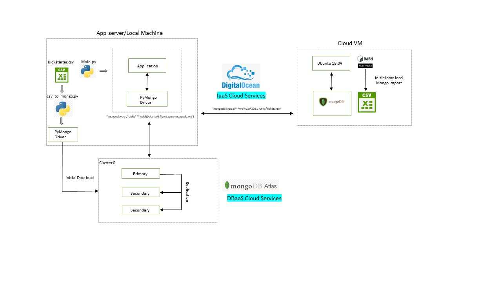
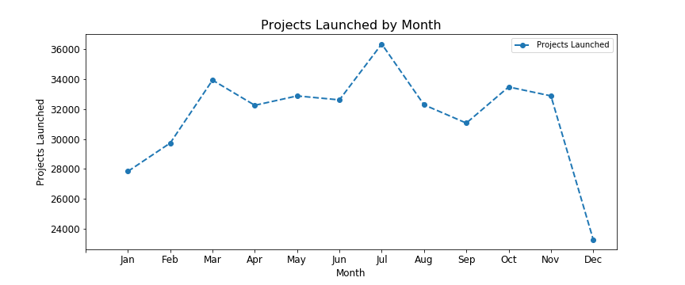
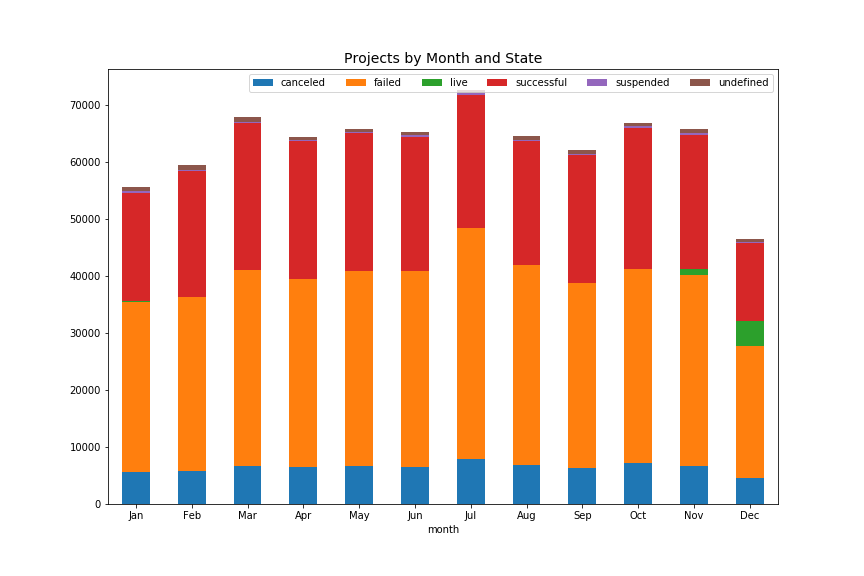
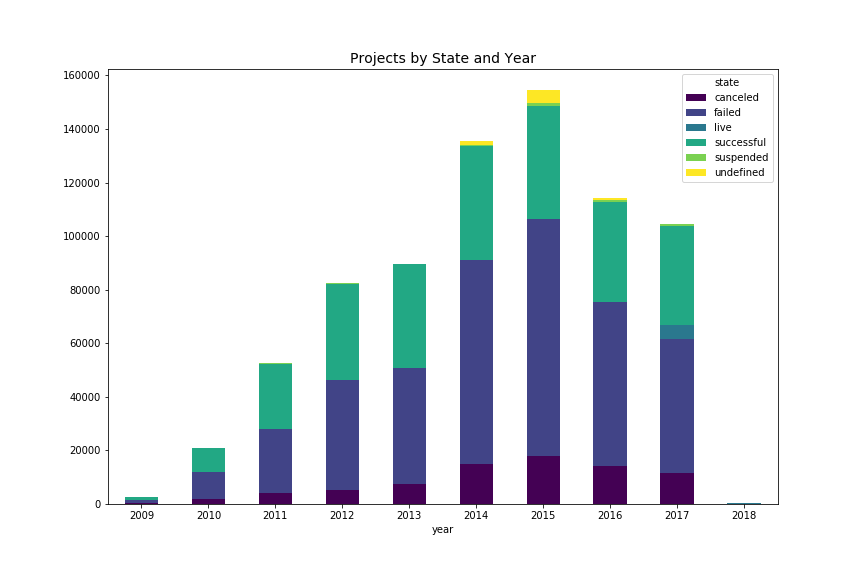
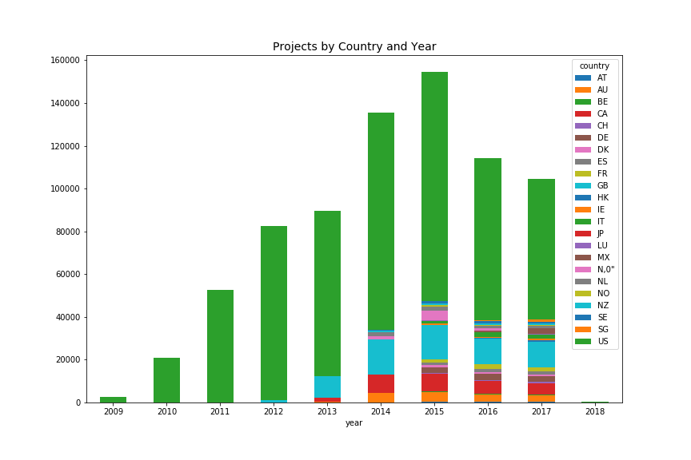
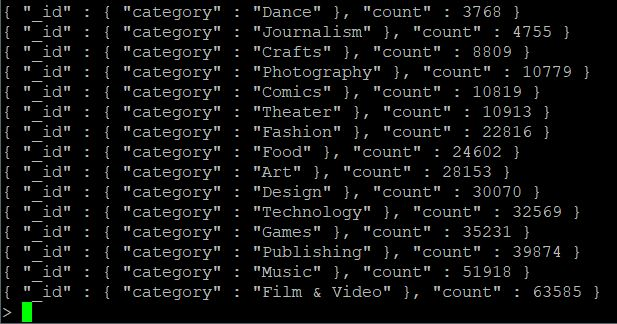
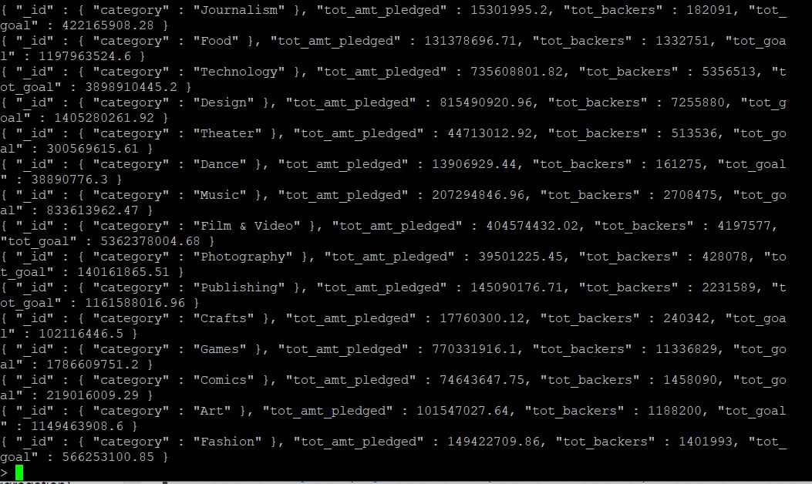

# Kickstarter Projects Analysis :hand: fa18-523-60, fa18-523-64, fa18-523-72

| Izolda Fetko, Nishad Tupe, Vishal Bhoyar
| ifetko@iu.edu, ntupe@iu.edu, vbhoyar@iu.edu
| Indiana University
| hid: fa18-523-60, fa18-523-64, fa18-523-72
| | github: [:cloud:](https://github.com/cloudmesh-community/fa18-523-60blob/master/project-report/report.md)
| code: TBD

---

Keywords: MongoDB, PyMongo, Crowdfunding, Virtual Machine, Cloud, Data Analysis, Cloud Performance
          
---

## Abstract

Crowdfunding is a certain way of raising funds where 
individuals come together and collectively support 
projects by investing in them. Kickstarter is one 
of the leading crowdfunding platforms in the world
that helps individuals/businesses in various categories 
such as art, film, music, theatre, games, design, and 
other, to raise necessary funds to complete their projects. 
This paper explores the utilization of big data technologies 
and cloud services such as MongoDB, virtual machines, 
MongoDB Atlas, DigitalOcean, AWS, and PyMonogo while 
analyzing the *Kickstarter Projects* dataset obtained 
from the Kaggle datascience platform.

## Introduction

Many creative individuals and groups around the globe are trying 
to develop products, projects, and businesses based on their 
unique ideas and talents. In many cases, an idea or a talent 
is not enough to accomplish this. Capital funds are one of the 
main elements of a successful startup process. Although there 
is a significant number of government programs in the United 
States designed to help small businesses and creative indivials 
to obtain necessary funds for their projects, a high number of 
start-ups nonetheless remain capital constrained [@www-voelker]. 
This is the reason why the *Kickstarter* platform was developed 
and is still successfully operating since 2009 [@www-voelker].

*Kickstarter* is a web-based crowdfunding platform that helps 
support creative arts around the globe [@www-voelker].
It uses the fundable project model where the would-be business 
owners or project managers submit their project along with the 
necessary project information and its funding goal.

> "The funding goal establishes a base target for the project 
> and a deadline (generally 30-days) to achieve the funding" 
> [@www-voelker]. 

The prospective artists and entrepreneurs typically display their 
projects in a video form where they have the opportunity to outline
the project along with its benefits and funding requirements 
[@www-voelker]. The video is shown on the *Kickstarter* project 
webpage along with the number of backers, the amount of funds 
received/pledged as well as the fundraising goal. As each project 
is timed, the time remaining in the *Kickstarter* promotion is 
shown on the project page as well. Since the platform is based on 
an *all or nothing* funding model, pledged funds are not available 
to the entrepreneurs until the end of the funding period which 
is determined by the goal-setting statement [@www-voelker]. The 
financial transcations occur only in cases where a projects meets 
its initial targets and funding expectations [@www-voelker]. If 
the initial target is exceeded, the project received all funding 
as well as the excess of its goal.

Our project includes several big data technologies while exploring 
the *Kickstarter* dataset collected in the 2009-2018 timeframe and 
made public via Kaggle, a well known datascience platform. The base
technology used to store and query the dataset is the widely known
NoSQL database called MongoDB. Three cloud services chosen to be 
benchmarked against each other are MongoAtlas, DigitalOcean, and 
AWS. Our team had developed a Python program and a packaged shell 
script that builds the MongoDB environment on a Unix platform, 
performs data analysis through visualizations to gain hidden insights  
and builds a logstic regression model to predict the success/failure
of the *Kickstarter* projects. MongDB database is hosted on different 
cloud environments. The time needed to query the dataset was used 
as a quantitative measure to analyze the relative benchmarking. 
Moreover, our team also provides an ease-of-use review of each 
service as an addition to the performance benchmarking. 
This report introduces the reader to the related work in the 
MongoDB realm, as well as to the chosen dataset prior to 
presenting the project design and research methods, architecture, 
technologies, and results. 

## Literature review

MongoDB and Python both are open source technologies. One can 
get started quickly building an application on MongoDB using 
any of the languages that leverage MongoDB's driver. MongoDB 
offers a native driver called PyMongo to fit Python developer 
community needs.

> "MongoDB stores data in documents, however, they are not like 
> Microsoft Word or Adobe PDF documents but rather JSON documents 
> based on the JSON specification" [@www-pymongo].

There are several advantages of storing data in document format 
and some of them are flexible schema and ability to store arrays 
which are faster to process using native commands of Python scripts 
[@www-pymongo]. In June 2018, students of the Indiana University, 
Bloomington Izolda Fetko, Rashmi Ray, and Nishad Tupe explored 
the France accidents dataset using MongoDB, PyMongo, and Tableau 
to provide safety recommendations. They used the newest release 
of the MongoDB driver called the  *Mongo BI connector* that 
allowed BI tools such as Tableau to interact with MongoDB. 
The BI connector converts the Tableau's SQL-like commands on 
structured data into the native MongoDB commands while fetching 
data [@www-mongotab]. The team also used PyMongo and other web 
technologies to build the website that could store, update, and 
process records live and can be accessed by the global audience. 
As MongoDB is a NoSQL engine, it scales easily for multiple tables 
as a single JSON object, and makes query retrieval speed faster 
than RDBMS, while avoiding complex joins. However, the research also 
showed that Tableau and MongoDB is a lousy marriage predominantly 
because Tableau was built before the NoSQL and Big Data were popular 
and is not yet mature to process relational data [@www-mongoknowi]. 
Tableau's slow processing of joins, when connected directly to 
MongoDB, was one of the main reason authors decided to join the 
CSV files using Pandas data frame and use MongoDB as a backend tool. 
This tool allows a stable platform for the user-friendly BI tools 
such as Tableau to perform analytics on large datasets with millions 
of rows and also to stand as a robust database on which one can 
build applications [@www-mongotab]. In the final step, authors 
created a website and provided links to various dashboards 
using technologies such as HTML, CSS, JavaScript, Bootstrap, 
Flask, JQuery.js, and Chartist.js [@www-mongotab]. Although
the goals of the aforementioned and our current project differ,
they do share a lot of similarities in sense of using the exact
same big data technologies MongoDB and Python. 

Another paper written by [@www-matei], presents an interesting
benchmarking of the MongoDB database on several cloud instances.
In his report, [@www-matei] notes that each virtual instance
had the MongoDB and PyMongo installed on it. The similarity
between this report and our project is that both exploit the
benefits of the PyMongo driver and the Amazon Web Services, 
more specifically the *EC2* instances. In addition to the AWS, 
[@www-matei] used Linode, a hosting company that offers a virtual 
private server (VPS); Rackspace cloud and its open source technology 
*OpenStack*; and Windows Azure and its virtual machines [@www-matei].
In the finalsection of his paper, [@www-matei] concludes that MongoDB's 
performance varies from cloud to cloud due to various factors. One of 
the most important factors that he lists are the fast I/O access and 
ability of the database to cach all indexes in RAM [@www-matei].

The report by [@www-bigbee] shows similarities to our report 
in the sense of benchmarking MongoDB using the AWS. However,
in his report, [@www-bigbee] takes a step further and compares
the MongoDB performance to other databases such as CouchDB and
Apache Spark. He concludes that MongoDB performs well on the
cloud with ultra-low latency which makes it a great choice 
for applications with flexible schema requirements [@www-bigbee].

The article written by [@www-sverchkov], presents NoSQL database
benchmarking with the use of the Yahoo Cloud Benchmark (YCSB) and 
Amazon Web Services with an installed Linux operating system 
[@www-sverchkov]. The purpose of his article is to help developers 
choose the right database for their application. He tested Cassandra 
2.0, MongoDB 2.4.6, HBASE 0.92 and concluded that developers 
need to evaluate different solutions in their search, and test their 
performance first prior to making any decisions [@www-sverchkov]. 
According to him, all databases are good in some way, but may perform 
differently in different scenarios, hence, it is important to chose them
based on the most needed properties and project requirements [@www-sverchkov].
The similarity between this project and our project is the use of the
Amazon Web Services as a benchmarking tool for MongoDB. 

## Dataset Description

### Kaggle API

The technology used to easily obtain the Kickstarter Projects 
dataset is the newly offered Kaggle Public API. API stands for 
*Application Programming Interface* through

> "which interactions happen between an enterprise and applications 
> that use its assets" [@www-apiwiki].

Kaggle Public API was launched in February 2018 and can be used for 
*creating datasets, kernels*, or simply *connect with Kaggle* 
[@www-kaggleapi]. Although still in its beta phase, it allows a more 
user-friendly data download as well as a seamless workflow for 
its community members. To be able to use this technology, users 
need to ensure that they had installed the latest Python 3 version 
on their machines as well as the pip package manager [@www-githubkagapi].
Accessing the Kaggle API is done by using a simple command line; however, 
this is not possible until a Kaggle account is created 
[@www-githubkagapi]. Once the initial step had been completed, an 
API token can be created, which triggers a download of a JSON file 
that contains the user credentials necessary to access the API 
[@www-githubkagapi]. Once the sign-up had been finalized, various 
command lines can be used to access the list of competitions along 
with the files and submissions associated with them [@www-githubkagapi]. 
A different set of commands can be used for dataset downloads and 
dataset creation, while the final group of commands listed on the 
Kaggle API GitHub page are the commands to manage Kernels, more 
specifically Kernel pull and push [@www-githubkegapi].

The importance of the Kaggle's public API is significant. It minimizes 
the need for its users to manually download large datasets, hence saving 
them time when working on important projects. It is also helping students 
in expanding their knowledge and programming experience through practical 
examples and real-life data that can be later implemented in their 
professional work.

### Kickstarter Projects Dataset

The *Kickstarter Projects* dataset is publicly available on the Kaggle website
and can be accessed using this [path](https://www.kaggle.com/kemical/kickstarter-projects#ks-projects-201801.csv).
The instructions on how to obtain the dataset using the Kaggle API can be found
[here](https://github.com/cloudmesh-community/fa18-523-60/blob/master/project-report/dataset/Kaggle%20API%20and%20Dataset%20Download%20Instructions.txt).
The dataset is available in the CSV format and contains more than 370 thousand 
projects submitted to Kickstarter between 2009 and 2018 [@www-kaggle-kickstarterdata]. 
The dataset variables allow versatile data analysis which is presented in the *Results* 
segment of our project. Other than the project ID, the dataset contains information 
on the project name; main category and category of campaign; currency used to support 
the project; fundraising goal (the amount of funds needed to complete the project); 
project launch; project crowdfunding deadline; state – current state of the project; 
actual funds pledged to the project along with the number of backers; the country of 
origin; and the total amount of funds pledged by currency [@www-kaggle-kickstarterdata].

## Design and Methods
We have used the methodology as shown in the process diagram to conduct our 
study and publish the results. One of the primary aims of the project was to 
utilize the minimal cost cloud resources. Thankfully nowadays every coud 
provider provides a free tier. To leverage this, we created VM's on Amazon Web 
Services(AWS), Digital Ocean cloud services with more or less with the same 
basic configuration of memory and hard disk. The AWS and Digital Ocean primarily 
*IaaS* service while MongoDB Atlas *DBaaS* this also gave the opportunity to 
test the solution various cloud providers and benchmark their performance with 
pros and cons. Although the cloud VM's gave us the lot more control and 
customization over the OS and database level resources, MongoDB Atlas cloud 
services provided the stable database clustered environment for high 
availability of data. There was no overhead of configuring MongoDB instance as 
it's "DBaaS" service. We decided to leverage Unix bash script to perform a task 
such as automatically. 

1. Download the dataset 

2. Install MongoDB 

3. Import the MongoDB 

4. Run the Python Analysis. 

Thus achieving the stable infrastructure 
foundation on cloud based VM's, we had moved on to loading the data 
using two methods 1. Python script based method for DBaaS 2. MongoImport for 
cloud VM's Before beginning the analysis, it is essential to extract essential 
features. We used Python date time library to get the date, year, month, clean 
up the *NaN* rows carefully and also to calculate the duration of the project. 
The next step encompassed in data enhancement by extracting the features that 
can give a foundation to perform various analysis and develop machine learning
model. During the aforementioned process, our team had utilized the following 
methods to complete the data analysis and draw 
insights from the dataset. 

1. Exploratory Analysis and Visualization. 

   Data Visualizations that let you discover trends or patterns in
   a data set are called Exploratory Data analysis.Once the data
   is in good shape, it is easier to gain the understanding of the data
   and visualization often becomes handy tool to find the interesting
   patterns.

2. Correlation or Heatmap analysis
          
   The correlation analysis is a statistical method used to 
   evaluate a relationship between two continuous variables 
   [@www-correlation]. 
                         
3. Timeseries Analysis
          
   The time series analysis is a statistical technique which is related 
   to data that is distributed in a series of particular time periods or
   intervals [@www-timeseries].

4. Perform MongoDB queries
   The gist of our project to show the mongoDB ability to query it real time
   hence using MongoDB aggregation framework to Analyze the data using 
   MongoDB queries. 
   
5. Logistic Regression model for predicting Success and Failure
          
   The logistic regression analysis is a predictive analysis
   used to descrpibe a relationship between one dependent and 
   one or more nominal, ordinal, interval, or ratio-level independent
   variables [@www-logreg]. 

## Technologies

### Technologies and Tools Used

* Python version 3.6 and its libraries Seaborn, Matplotlib, Pandas, and NumPy
* PyMongo Driver, Bash Shell 
* Cloud services - MogoDB Atlas, 3 node replica cluster
* Cloud services - Digital Ocean, Ubuntu 18.04 ,MongoDB 3.6.3
* Cloud services - AWS , Amazon Elastic Comput Cloud (EC2), Linux, MongoDB 3.6.3

## Code Organization

Our code is checked-in on GitHub and can be accessed by using this 
[link](https://github.com/cloudmesh-community/fa18-523-60/tree/master/project-report/bin).
It is organized as described in the following section.

### bin

  - main.py 
  - load_csv.py
  - mongo_install.sh
  - mongo_uninstall.sh 

## Architecture

Since the beginning of our project, the team aimed to create a scalable Python 
code that can run seamlessly on different cloud environments. We mainly used 
cloud computing services from Amazon Web Services (*AWS*), *DigitalOcean* 
as *IaaS* and *MongoDB Atlas* as a *DBaaS* platform. Though *AWS* is giant a
cloud provider with multiple cloud services, we found that *DigitalOcean's* 
user-friendly virtual machine (VM's) management interface is equally attractive. 
The architecture diagram +@fig:architecture more specifically the upper
left dotted box, shows the client machine or application tier where the 
source code(*.py*) was stored and used for performance benchmarking. 

{#fig:architecture}

The team also kept a copy of the source code and other scripts on the cloud 
VM's file systems. We used PyMongo driver as one of the primary components 
for communicating with the MongoDB database. PyMongo does not only
provide the MongoDB driver access to Python libraries, but is also a 
recommended choice when wrangling data with MongoDB [@www-mongodbpymongo]. 

During the initial loading phase of the *Kickstarter* dataset, our team
imported the raw data using the MongoDB import command line in the 
*DigitalOcean* and *AWS* cloud VM's. A custom bash shell script that 
installs, configures the MongoDB environment and then imports the CSV 
data to MongoDB was also written. To load the data in the MongoDB 
Atlas cluster,  we used a simple Python function *load_csv.py*. The 
primary reason for this is because MongoDB Atlas is a *DBaaS* cloud 
service and typically in *DBaaS* users do not have control or access 
to OS resources such as a file system. In most basic form, our M0 
cluster consists of one primary node and two secondary nodes. The 
primary nodes are mainly responsible for writing operations, while 
the secondary nodes replicate primary's *oplog*.  This way the 
secondary node's dataset reflects the primary's dataset in cases 
where the primary node is unavailable [@www-mongodbreplica]. Only 
the eligible secondary nodes will

> "hold an election to elect itself the new primary" [@www-mongodbreplica]. 

This replica set arrangement ensures high availability of data. 
Optionally, one can configure the arbiter node which does not 
hold any data but keeps the track quorum in the replica set. Since 
arbiter nodes do not hold any data, they act as a suitable repository 
to keep the heartbeat information at a cheaper cost [@www-mongodbreplica]. 
On the contrary, our team had found that the *IaaS* services 
provide greater control and customization to the OS resources 
but add overhead to perform the configuration and other tasks 
which can be complex and may induce a lag time for writing the 
code due to incomplete pre-requisites. On the cloud VM's, the team 
hosted a single instance MongoDB database on Ubuntu 18.04 platform. 
As post install steps, our team had installed the Python Anaconda 
Distribution and other necessary libraries essential to complete 
the analysis. The communication between MongoDB and Python application
happens by connecting string. The connect strin, one must have a valid 
username and password and necessary privileges to access and modify 
the database. To accept the remote connection, one of the vital 
steps is to set a value of *bind_ip* to 0.0.0.0 in the *mongodb.conf* 
file that resides on the VM. For all cloud providers, our team had 
used free-tier services. We observed notable advantage of using 
MongoDB Atlas free tier service often called as *M0 cluster*. 
By default, the *M0 cluster* comes with three node replica sets 
and 512 MB storage. The replica set is a group of *mongod* processes 
which provide redundancy and high availability to the application 
while accessing the MongoDB data. 

## Observations and Visualizations

Our team had completed an exploratory analysis of the *Kickstarter* dataset. 
The results of the analysis can be observed in the following section.

### Exploratory Analysis

The bar chart visualization in +@fig:Top main categories Average goal shows 
the top *Kickstarter Projects* main categories using the successful and 
failed projects. In order to create this visual, the funding goal data 
first needed to be grouped based on the successful and failed project status.
The categories are represented on the *y* axis, while the average project 
funding goal data is represented on the *x* axis. The average funding goals 
for the failed projects are highlighted in blue, while the green bars are 
representing average funding goals for the successful projects. The results 
of this visualization indicate that the top average funding goals for both 
failed and successful projects are within the *Technology* category. As 
expected, the goals for the this category are set higher than for the others, 
for example *Craft*, which shows the lowest average funding goal in both 
successful and failed projects. 


{#fig:Top main categories Average goal}
 
The bar plot visualization is showing successful and failure project count 
data for different years. The horizontal axis is showing the project launch 
years and vertical axis is showing the number of successful and failure 
project count for each years. 
 
The stacked chart visualization is showing project count data for different
categories stacked with project status. The horizontal axis for the chart is 
showing categories data and vertical axis is showing project counts for each 
categories. The horizontal axis is short in alphabetical order. The most of 
the project categories are showing large failure project counts. The Film & 
Video category has maximum project count with higher successful and failed
project status. The Dance category has lowest project count with only 
successful and failed status.
 
The top market visualization shows the list of top countries which has most
pledged funding for the projects. The horizontal axis in chart is showing 
countries information sorted on number of pledged funding. The vertical axis
is showing pledged funding for the projects. The pledged fund divided on
project status. Jordan country has maximum pledged amounts with successful 
and failed status.
 
The Average pledged amounts visualization +@fig:Average Pledge Amount by category 
shows top Kickstarter projects main categories with successful and failed project. 
The vertical axis in bar chart is showing average pledged funding data. The 
horizontal axis is the main categories for projects. The Technology category 
is showing high average pledged amounts for successful and failed projects.
 

### Time Series Analysis

The time-series analysis conducted by the team revealed certain trends in
the *Kickstarter* dataset which will be presented in the following segment.
One of the trends noted was that the projects mostly get launched in the 
warmer months with July being the month with the highest number of projects.
The trend of the launched projects by months can be seen in +@fig:pjbym.

{#fig:pjbym}

Drilling further into the project by month data, one can notice taht 
proportionally to the number of launched projects, July is the month with 
the highest number of cancelled and failed projecs. The number of live projects
is higher in winter months, mostly in November and December, however, the overall
number of projects drastically decreases most likely due to the holidays.

{#fig:pjbyms}

Loogking at the same categories over the years, from +@fig:pjbyys one can 
conclude that overall, 2015 was a great year for *Kickstarter* with the highest 
number of submitted projects, but also, proportionally, the largest portion of 
the failed projects. 

{#fig:pjbyys}

When it comes to the countries from which the projects were submitted in the
2009-2017 timeframe, one can conclude that *Kickstarter* was popular and 
available only in the United States in the first four years of its activity.
In 2013, for the first time, one can notice other countries making project
contributions such as Canada and New Zealand. In the follwoing years, the 
number of contributing countries rises, however, the leading one still 
remains the US.

{#fig:pjbyyc}

### Logistic Regression
some text


{#fig:selecting top 5 categories for model prediction}


some text


{#fig:Top 5 Categories Success Failed}

some text


{#fig: Confustion Matrix for ML}


### MongoDB Queries

Our team had also had the opportunity to write MongoDB queries directly 
working in MongoAtlas with a purpose to compare the ease-of-use 
related to querying of the *Kickstarter* data between MongoDB and
Python. One of the queries included the count of projects by category.

```
> db.project.aggregate([
          {$group:{_id:{category:"$main_category"}, count:{$sum:1}}},
          {$sort:{count:1}}
          ])
```
The output of this query can be seen in +@fig:projbycat.

{#fig:projbycat}

From the results we can see that the highest number of the overall 
submitted projects was in the *Film and Video* category. This
makes sence when we take into consideration the number of
smart phones and camera devices in the world. These technologies
have made this art more available to amateurs. In a similar 
manner, the team had written a query to count the number of 
projects by year. 

```
> db.project.aggregate([
          {$group:{_id:{year:"$year"}, total_number_of_projects:
          {$sum:1}}},
          {$sort:{_id:1}}
          ])
```

The results in this query have shown that the number of projects
varied through out the years, and that the highest number of 
projects was submitted in 2015. Finally, a query that resembles 
the previous two is the total count of projects by project state,
which revealed that the vast majority of projects that get 
submitted also get funded.

```
> db.project.aggregate([
          {$group:{_id:{state:"$state"}, count:{$sum:1}}},
          {$sort:{count: -1}}
          ])
```

A slightly more complex query was used to compute the total amount of 
the pledged funds, number of backers (investors), and total funding 
goal by project category. It revealed that the best performing 
categories according to these criteria are *Design*, *Technology*, 
and *Games*. 

```
> db.project.aggregate([
          {$group:{_id:{category:"$main_category"}, tot_amt_pledged:
          {$sum:"$pledged"}, tot_backers:{$sum:"$backers"}, tot_goal:
          {$sum:"$goal"}}}
          ])
```

{#fig:totalmetrbycat}

In a similar fashion, the average metrics by category were 
obtained thanks to the following query: 

```
> db.project.aggregate([
          {$group:{_id:{category:"$main_category"}, avg_amt_pled:
          {$avg:"$pledged"}, avg_backers:{$avg:"$backers"}, avg_goal:
          {$avg:"$goal"}}},
          {$sort:{avg_amt_pled: -1}} 
          ])
```

From the results we can conclude that the best category is again 
*Design*, which is in line with the results from the previous 
query.

{#fig:avgmetrbycat}

Although querying in MongoDB is relatively simple, the team had
concluded that compared to Python it is less user-friendly,
which is in line with Python's flexible programming nature.

## Conclusion
TBD

## Acknowledgement
TBD

## Workbreakdown
TBD
